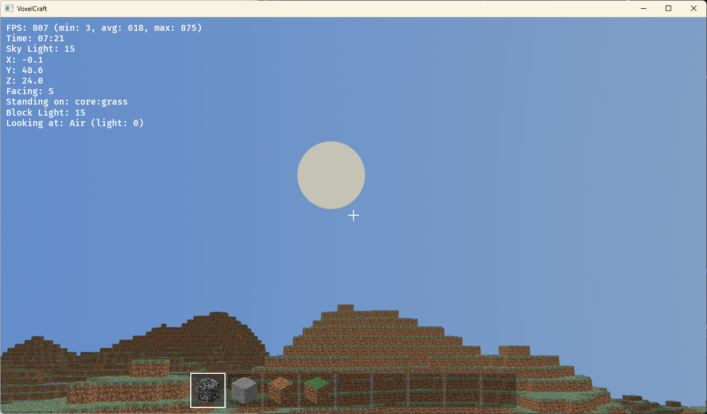
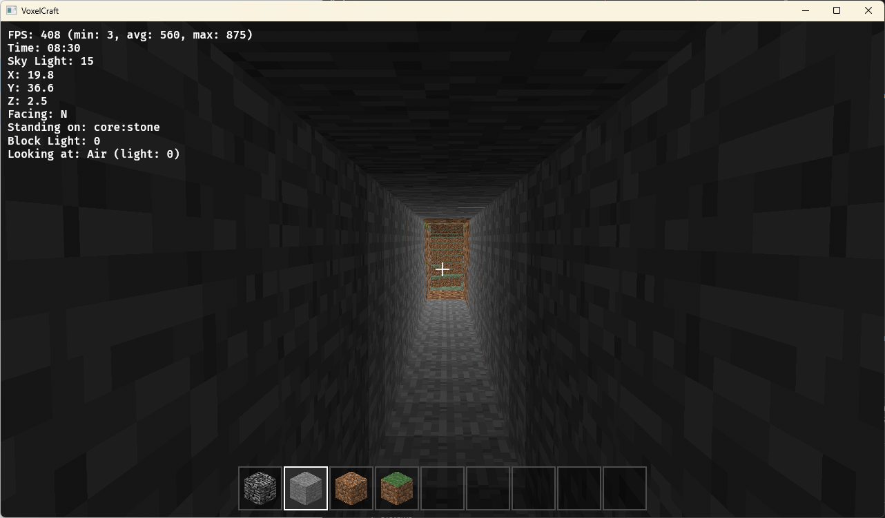
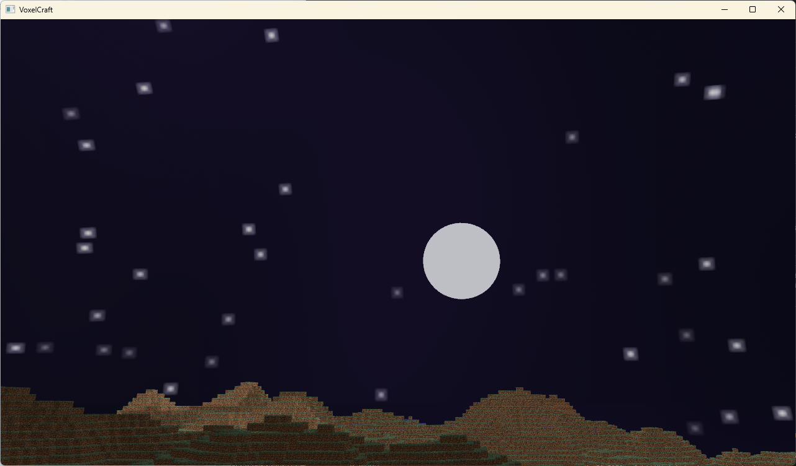

# VoxelCraft

> **lol vibe coded minecraft**
>
> This entire project was vibe coded with Claude Opus 4.5 and Sonnet 4.5. The project has potential but likely won't be continued. That said, PRs are encouraged.

---

A Minecraft-inspired voxel game built with Rust and Bevy ECS, featuring physically-based rendering and a comprehensive plugin system for modding.

## Screenshots


*Early morning with the moon setting and procedurally generated terrain*


*Mining tunnel with per-face lighting and block highlighting*


*Night time with stars and moon*

## Texture Setup (Required)

This project uses Minecraft's classic texture atlas formats. You need to provide your own textures:

### Block Textures
1. Get `terrain.png` from Minecraft 1.5.2 or earlier (the 256x256 block texture atlas)
2. Rename it to `atlas.png`
3. Place it in `assets/mods/core/textures/atlas.png`

Without this file, blocks will render with missing textures.

### GUI Icons (Health/Hunger)
1. Get `icons.png` from Minecraft (the GUI icons atlas, 256x256)
   - Any version from 1.4.2 up to 1.19 should work
   - Found in `assets/minecraft/textures/gui/icons.png` in the game JAR
2. Place it in `assets/mods/core/textures/icons.png`

Without this file, health and hunger bars will not display in survival mode.

## Controls

### Movement
- **W/A/S/D** - Move forward/left/backward/right
- **Space** - Jump / Fly up (creative mode)
- **Shift** - Sneak / Fly down (creative mode)
- **Double-tap Space** - Toggle fly mode (creative mode)

### Camera
- **Mouse** - Look around
- **Scroll Wheel** - Cycle hotbar selection

### Block Interaction
- **Left Click** - Break block
- **Right Click** - Place block
- **1-9 Keys** - Select hotbar slot

### Debug & UI
- **F1** - Toggle UI visibility
- **F3** - Toggle debug overlay (coordinates, FPS, light levels)
- **F4** - Toggle creative/survival mode
- **F7** - Toggle light level overlay (red = mob spawn, yellow = unsafe at night)
- **F9** - Cycle chunk border modes (Off → Mode1 → Mode2)
- **Ctrl** - Sprint (hold while moving)

### Time Controls
- **T** - Pause/unpause day/night cycle
- **[ / ]** - Slow down / speed up time
- **< / >** - Jump backward/forward 1 hour

### System
- **Escape** - Pause menu / Release mouse

## Requirements

- Rust (latest stable version)
- Cargo

## Building and Running

```bash
cargo run --release
```

Release mode is recommended for playable framerates.

## Architecture

Built with Bevy ECS featuring:
- Chunk-based voxel world with infinite terrain generation
- Per-face lighting with day/night cycle
- First-person camera with physics
- Mod/plugin system for extensibility

## Dependencies

- **bevy** - Game engine with ECS architecture
- **noise** - Procedural terrain generation
- **rand** - Random number generation
